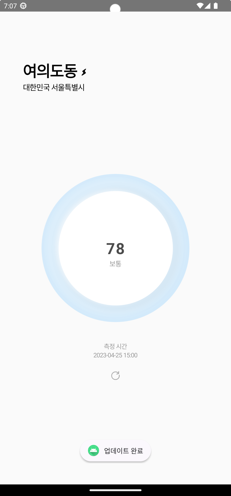

# 학습
## 초기 설정
### 완성된 모습

<p align="center">

</p>

### Gradle JDK

- corretto-17

### Gradle

build.gradle(project)

```groovy
plugins {
    id 'com.android.application' version '8.0.0' apply false
    id 'com.android.library' version '8.0.0' apply false
    id 'org.jetbrains.kotlin.android' version '1.8.0' apply false
}
```

build.gradle(app)

```groovy
plugins {
    id 'com.android.application'
    id 'org.jetbrains.kotlin.android'
    // Annotation 지원
    id 'kotlin-kapt'
}

android {
    namespace 'com.hyunseokcheong.airquality'
    compileSdk 33

    defaultConfig {
        applicationId "com.hyunseokcheong.airquality"
        minSdk 26
        targetSdk 33
        versionCode 1
        versionName "1.0"

        testInstrumentationRunner "androidx.test.runner.AndroidJUnitRunner"
    }

    buildTypes {
        release {
            minifyEnabled false
            proguardFiles getDefaultProguardFile('proguard-android-optimize.txt'), 'proguard-rules.pro'
        }
    }

    // corretto - 17
    compileOptions {
        sourceCompatibility JavaVersion.VERSION_17
        targetCompatibility JavaVersion.VERSION_17
    }

    kotlinOptions {
        jvmTarget = '17'
    }

    // data binding
    viewBinding {
        enabled = true
    }
}
dependencies {

    implementation 'androidx.core:core-ktx:1.10.0'
    implementation 'androidx.appcompat:appcompat:1.6.1'
    implementation 'com.google.android.material:material:1.8.0'
    implementation 'androidx.constraintlayout:constraintlayout:2.1.4'
    testImplementation 'junit:junit:4.13.2'
    androidTestImplementation 'androidx.test.ext:junit:1.1.5'
    androidTestImplementation 'androidx.test.espresso:espresso-core:3.5.1'

    // retrofit
    implementation 'com.squareup.retrofit2:retrofit:2.9.0'
    implementation 'com.squareup.retrofit2:converter-gson:2.9.0'
}
```

plugin

[json to kotlin class](https://plugins.jetbrains.com/plugin/9960-json-to-kotlin-class-jsontokotlinclass-): Json 형식으로 입력을 받아 Kotlin Class를 생성해주는 플러그인

## 내 위치 가져오기

1. MainActivity.kt

```kotlin
package com.hyunseokcheong.airquality

import android.Manifest
import android.content.DialogInterface
import android.content.Intent
import android.content.pm.PackageManager
import android.location.Address
import android.location.Geocoder
import android.location.LocationManager
import android.os.Bundle
import android.provider.Settings
import android.widget.Toast
import androidx.activity.result.ActivityResultLauncher
import androidx.activity.result.contract.ActivityResultContracts
import androidx.appcompat.app.AlertDialog
import androidx.appcompat.app.AppCompatActivity
import androidx.core.app.ActivityCompat
import androidx.core.content.ContextCompat
import com.hyunseokcheong.airquality.databinding.ActivityMainBinding
import com.hyunseokcheong.airquality.retrofit.AirQualityResponse
import com.hyunseokcheong.airquality.retrofit.AirQualityService
import com.hyunseokcheong.airquality.retrofit.RetrofitConnection
import retrofit2.Call
import retrofit2.Callback
import retrofit2.Response
import java.io.IOException
import java.time.ZoneId
import java.time.ZonedDateTime
import java.time.format.DateTimeFormatter
import java.util.Locale

class MainActivity : AppCompatActivity() {
    lateinit var binding: ActivityMainBinding
    lateinit var locationProvider: LocationProvider
    
    private val PERMISSIONS_REQUEST_CODE = 100
    
    var REQUIRED_PERMISSIONS = arrayOf(Manifest.permission.ACCESS_FINE_LOCATION, Manifest.permission.ACCESS_COARSE_LOCATION)
    
    lateinit var getGPSPermissionLauncher: ActivityResultLauncher<Intent>
    
    
    override fun onCreate(savedInstanceState: Bundle?) {
        super.onCreate(savedInstanceState)
        binding = ActivityMainBinding.inflate(layoutInflater)
        setContentView(binding.root)
        
        checkAllPermissions()
        updateUI()
        setRefreshButton()
    }
    
    private fun updateUI() {
        locationProvider = LocationProvider(this@MainActivity)
        
        val latitude: Double? = locationProvider.getLocationLatitude()
        val longitude: Double? = locationProvider.getLocationLongitude()
        
        if (latitude != null && longitude != null) {
            // 1. 현재 위치 가져오고 UI 업데이트
            val address = getCurrentAddress(latitude, longitude)
            
            address?.let {
                binding.tvLocationTitle.text = "${it.thoroughfare}"
                binding.tvLocationSubtitle.text = "${it.countryName} ${it.adminArea}"
            }
            // 2. 미세먼지 농도 가져오고 UI 업데이트
            getAirQualityData(latitude, longitude)
            
        } else {
            Toast.makeText(this@MainActivity, "위도, 경도 정보를 가져올 수 없습니다.", Toast.LENGTH_LONG).show()
        }
    }
    
    private fun getAirQualityData(latitude: Double, longitude: Double) {
        var retrofitAPI = RetrofitConnection.getInstance().create(
            AirQualityService::class.java
        )
        
        // execute(): 동기 실행
        // enqueue(): 비동기 실행
        
        retrofitAPI.getAirQualityData(latitude.toString(), longitude.toString(), "99db7ba4-eb75-4406-a584-67625df9278b")
            .enqueue(object : Callback<AirQualityResponse> {
                override fun onResponse(
                    call: Call<AirQualityResponse>,
                    response: Response<AirQualityResponse>
                ) {
                    if (response.isSuccessful) {
                        Toast.makeText(this@MainActivity, "업데이트 완료", Toast.LENGTH_LONG).show()
                        response.body()?.let { updateAirUI(it) }
                    } else {
                        Toast.makeText(this@MainActivity, "데이터를 가져오는 데 실패했습니다", Toast.LENGTH_LONG).show()
                    }
                }
                
                override fun onFailure(call: Call<AirQualityResponse>, t: Throwable) {
                    t.printStackTrace()
                    Toast.makeText(this@MainActivity, "데이터를 가져오는 데 실패했습니다", Toast.LENGTH_LONG).show()
                }
            })
    }
    
    private fun updateAirUI(airQualityData: AirQualityResponse) {
        
        val pollutionData = airQualityData.data.current.pollution
        val dateTime = ZonedDateTime.parse(pollutionData.ts).withZoneSameInstant(ZoneId.of("Asia/Seoul")).toLocalDateTime()
        val dateFormatter = DateTimeFormatter.ofPattern("yyyy-MM-dd HH:mm")
        
        binding.tvCount.text = pollutionData.aqius.toString()
        binding.tvMeasuredAt.text = dateTime.format(dateFormatter).toString()
        
        when (pollutionData.aqius) {
            in 0..50 -> {
                binding.tvTitle.text = "좋음"
                binding.imgBg.setImageResource(R.drawable.bg_good)
            }
            
            in 51..150 -> {
                binding.tvTitle.text = "보통"
                binding.imgBg.setImageResource(R.drawable.bg_soso)
            }
            
            in 151..200 -> {
                binding.tvTitle.text = "나쁨"
                binding.imgBg.setImageResource(R.drawable.bg_bad)
            }
            
            else -> {
                binding.tvTitle.text = "매우 나쁨"
                binding.imgBg.setImageResource(R.drawable.bg_worst)
            }
        }
    }
    
    private fun setRefreshButton() {
        binding.btnRefresh.setOnClickListener {
            updateUI()
        }
    }
    
    private fun getCurrentAddress(latitude: Double, longitude: Double): Address? {
        val geoCoder = Geocoder(this@MainActivity, Locale.KOREA)
        val addresses: List<Address>? = try {
            geoCoder.getFromLocation(latitude, longitude, 7)
            
        } catch (io: IOException) {
            
            Toast.makeText(this@MainActivity, "지오코더 서비스가 이용 불가합니다.", Toast.LENGTH_LONG).show()
            return null
            
        } catch (il: IllegalArgumentException) {
            Toast.makeText(this@MainActivity, "잘못된 위도, 경도입니다.", Toast.LENGTH_LONG).show()
            return null
            
        }
        if (addresses == null || addresses.size == 0) {
            Toast.makeText(this@MainActivity, "주소가 발견되지 않앗습니다.", Toast.LENGTH_LONG).show()
            return null
        }
        
        return addresses[0]
    }
    
    private fun checkAllPermissions() {
        if (!isLocationServicesAvailable()) {
            showDialogForLocationServiceSetting();
        } else {
            isRunTimePermissionsGranted();
        }
    }
    
    fun isLocationServicesAvailable(): Boolean {
        val locationManager = getSystemService(LOCATION_SERVICE) as LocationManager
        return (locationManager.isProviderEnabled(LocationManager.GPS_PROVIDER) || locationManager.isProviderEnabled(LocationManager.NETWORK_PROVIDER))
    }
    
    fun isRunTimePermissionsGranted() {
        val hasFineLocationPermission = ContextCompat.checkSelfPermission(this@MainActivity, Manifest.permission.ACCESS_FINE_LOCATION)
        val hasCoarseLocationPermission = ContextCompat.checkSelfPermission(this@MainActivity, Manifest.permission.ACCESS_COARSE_LOCATION)
        if (hasFineLocationPermission != PackageManager.PERMISSION_GRANTED || hasCoarseLocationPermission != PackageManager.PERMISSION_GRANTED) {
            ActivityCompat.requestPermissions(this@MainActivity, REQUIRED_PERMISSIONS, PERMISSIONS_REQUEST_CODE)
        }
    }
    
    override fun onRequestPermissionsResult(
        requestCode: Int,
        permissions: Array<out String>,
        grantResults: IntArray,
    ) {
        super.onRequestPermissionsResult(requestCode, permissions, grantResults)
        if (requestCode == PERMISSIONS_REQUEST_CODE && grantResults.size == REQUIRED_PERMISSIONS.size) {
            
            var checkResult = true
            
            for (result in grantResults) {
                if (result != PackageManager.PERMISSION_GRANTED) {
                    checkResult = false
                    break
                }
            }
            if (checkResult) {
                updateUI()
                
            } else {
                Toast.makeText(this@MainActivity, "퍼미션이 거부되었습니다. 앱을 다시 실행하여 퍼미션을 허용해주세요.", Toast.LENGTH_LONG).show()
                finish()
            }
        }
    }
    
    private fun showDialogForLocationServiceSetting() {
        getGPSPermissionLauncher = registerForActivityResult(ActivityResultContracts.StartActivityForResult()) { result ->
            if (isLocationServicesAvailable()) {
                isRunTimePermissionsGranted()
            } else {
                Toast.makeText(this@MainActivity, "위치 서비스를 사용할 수 없습니다.", Toast.LENGTH_LONG).show()
                finish()
            }
        }
        
        val builder: AlertDialog.Builder = AlertDialog.Builder(this@MainActivity)
        builder.setTitle("위치 서비스 비활성화")
        builder.setMessage("위치 서비스가 꺼져있습니다. 설정해야 앱을 사용할 수 있습니다.")
        builder.setCancelable(true)
        builder.setPositiveButton("설정", DialogInterface.OnClickListener { dialog, id ->
            val callGPSSettingIntent = Intent(Settings.ACTION_LOCATION_SOURCE_SETTINGS)
            getGPSPermissionLauncher.launch(callGPSSettingIntent)
        })
        builder.setNegativeButton("취소", DialogInterface.OnClickListener { dialog, id ->
            dialog.cancel()
            Toast.makeText(this@MainActivity, "기기에서 위치서비스(GPS) 설정 후 사용해주세요.", Toast.LENGTH_SHORT).show()
            finish()
        })
        builder.create().show()
    }
}
```

2. LocationProvider.kt

```kotlin
package com.hyunseokcheong.airquality

import android.Manifest
import android.content.Context
import android.content.Context.LOCATION_SERVICE
import android.content.pm.PackageManager
import android.location.Location
import android.location.LocationManager
import androidx.core.app.ActivityCompat

/**
 * 1. GPS 기반 위치
 * 2. 네트워크 기반 위치
 *
 * Case 1. 두 위치 모두 사용 가능: 정확도가 더 높은 위치 반환
 * Case 2. 한 위치만 사용 가능: 사용 가능한 위치 반환
 * Case 3. 두 위치 모두 사용 불가능: null 반환
 */
class LocationProvider(val context: Context) {
    private var location: Location? = null
    private var locationManager: LocationManager? = null
    
    init {
        getLocation()
    }
    
    private fun getLocation(): Location? {
        try {
            locationManager = context.getSystemService(LOCATION_SERVICE) as LocationManager
            
            var gpsLocation: Location? = null
            var networkLocation: Location? = null
            
            // 활성화 확인
            val isGPSEnabled = locationManager!!.isProviderEnabled(LocationManager.GPS_PROVIDER)
            val isNetworkEnabled = locationManager!!.isProviderEnabled(LocationManager.NETWORK_PROVIDER)
            
            if (!isGPSEnabled && !isNetworkEnabled) { // Case 3
                return null
            } else {
                if (ActivityCompat.checkSelfPermission(context, Manifest.permission.ACCESS_FINE_LOCATION) != PackageManager.PERMISSION_GRANTED
                    && ActivityCompat.checkSelfPermission(context, Manifest.permission.ACCESS_COARSE_LOCATION) != PackageManager.PERMISSION_GRANTED
                ) {
                    return null
                }
                
                if (isNetworkEnabled) {
                    networkLocation = locationManager?.getLastKnownLocation(LocationManager.NETWORK_PROVIDER)
                }
                
                if (isGPSEnabled) {
                    gpsLocation = locationManager?.getLastKnownLocation(LocationManager.GPS_PROVIDER)
                }
                
                // Case 1
                if (gpsLocation != null && networkLocation != null) {
                    if (gpsLocation.accuracy > networkLocation.accuracy) {
                        location = gpsLocation
                    } else {
                        // Todo 에뮬레이터 실습을 위해 주석처리 + 실제 기기에서는 주석 해제
                        //location = networkLocation
                        location = gpsLocation
                    }
                } else {
                    // Case 2
                    location = gpsLocation ?: networkLocation
                }
            }
        } catch (e: Exception) {
            e.printStackTrace()
        }
        
        return location
    }
    
    fun getLocationLatitude(): Double? {
        return location?.latitude
    }
    
    fun getLocationLongitude(): Double? {
        return location?.longitude
    }
}
```

3. activity_main.xml

```xml
<?xml version="1.0" encoding="utf-8"?>
<androidx.constraintlayout.widget.ConstraintLayout xmlns:android="http://schemas.android.com/apk/res/android"
    xmlns:app="http://schemas.android.com/apk/res-auto"
    xmlns:tools="http://schemas.android.com/tools"
    android:layout_width="match_parent"
    android:layout_height="match_parent"
    tools:context=".MainActivity">

    <TextView
        android:id="@+id/tv_location_title"
        android:layout_width="wrap_content"
        android:layout_height="wrap_content"
        android:letterSpacing="-0.04"
        android:text="thoroughfare"
        android:textColor="@color/black"
        android:textSize="32sp"
        android:textStyle="bold"
        app:layout_constraintStart_toStartOf="@+id/guideline1"
        app:layout_constraintTop_toTopOf="@+id/guideline4" />

    <TextView
        android:id="@+id/tv_location_subtitle"
        android:layout_width="wrap_content"
        android:layout_height="wrap_content"
        android:letterSpacing="-0.05"
        android:text="countryName"
        android:textColor="@color/black"
        android:textSize="16sp"
        app:layout_constraintStart_toStartOf="@+id/guideline1"
        app:layout_constraintTop_toBottomOf="@+id/tv_location_title" />

    <ImageView
        android:layout_width="10dp"
        android:layout_height="wrap_content"
        android:layout_marginStart="9dp"
        android:layout_marginTop="8dp"
        android:src="@drawable/iocn_thunder"
        app:layout_constraintBottom_toBottomOf="@+id/tv_location_title"
        app:layout_constraintStart_toEndOf="@+id/tv_location_title"
        app:layout_constraintTop_toTopOf="@+id/tv_location_title" />

    <ImageView
        android:id="@+id/img_bg"
        android:layout_width="0dp"
        android:layout_height="0dp"
        android:src="@drawable/bg_good"
        app:flow_verticalBias="0.4"
        app:layout_constraintBottom_toBottomOf="parent"
        app:layout_constraintDimensionRatio="h, 1:1"
        app:layout_constraintEnd_toEndOf="@+id/guideline3"
        app:layout_constraintStart_toStartOf="@+id/guideline2"
        app:layout_constraintTop_toTopOf="parent" />

    <TextView
        android:id="@+id/tv_count"
        android:layout_width="wrap_content"
        android:layout_height="wrap_content"
        android:letterSpacing="0.05"
        android:text="61"
        android:textColor="@color/text_grey"
        android:textSize="32sp"
        android:textStyle="bold"
        app:layout_constraintBottom_toBottomOf="@id/img_bg"
        app:layout_constraintEnd_toEndOf="@id/img_bg"
        app:layout_constraintStart_toStartOf="@id/img_bg"
        app:layout_constraintTop_toTopOf="@id/img_bg" />

    <TextView
        android:id="@+id/tv_title"
        android:layout_width="wrap_content"
        android:layout_height="wrap_content"
        android:letterSpacing="-0.05"
        android:text="보통"
        android:textColor="@color/text_light_grey"
        android:textSize="14sp"
        app:layout_constraintEnd_toEndOf="@id/img_bg"
        app:layout_constraintStart_toStartOf="@id/img_bg"
        app:layout_constraintTop_toBottomOf="@id/tv_count" />

    <TextView
        android:id="@+id/tv_measured_at_title"
        android:layout_width="wrap_content"
        android:layout_height="wrap_content"
        android:layout_marginTop="40dp"
        android:letterSpacing="-0.05"
        android:text="@string/measured_at"
        android:textColor="@color/text_light_grey"
        android:textSize="13sp"
        app:layout_constraintEnd_toEndOf="parent"
        app:layout_constraintStart_toStartOf="parent"
        app:layout_constraintTop_toBottomOf="@id/img_bg" />

    <TextView
        android:id="@+id/tv_measured_at"
        android:layout_width="wrap_content"
        android:layout_height="wrap_content"
        android:letterSpacing="-0.05"
        android:text="1993-10-06 16:40"
        android:textColor="@color/text_light_grey"
        android:textSize="13sp"
        app:layout_constraintEnd_toEndOf="parent"
        app:layout_constraintStart_toStartOf="parent"
        app:layout_constraintTop_toBottomOf="@+id/tv_measured_at_title" />

    <ImageView
        android:id="@+id/btn_refresh"
        android:layout_width="28dp"
        android:layout_height="28dp"
        android:layout_marginTop="20dp"
        android:padding="5dp"
        android:src="@drawable/icon_refresh"
        app:layout_constraintEnd_toEndOf="parent"
        app:layout_constraintStart_toStartOf="parent"
        app:layout_constraintTop_toBottomOf="@id/tv_measured_at" />

    <androidx.constraintlayout.widget.Guideline
        android:id="@+id/guideline1"
        android:layout_width="wrap_content"
        android:layout_height="wrap_content"
        android:orientation="vertical"
        app:layout_constraintGuide_percent="0.1" />

    <androidx.constraintlayout.widget.Guideline
        android:id="@+id/guideline2"
        android:layout_width="wrap_content"
        android:layout_height="wrap_content"
        android:orientation="vertical"
        app:layout_constraintGuide_percent="0.18" />

    <androidx.constraintlayout.widget.Guideline
        android:id="@+id/guideline3"
        android:layout_width="wrap_content"
        android:layout_height="wrap_content"
        android:orientation="vertical"
        app:layout_constraintGuide_percent="0.82" />

    <androidx.constraintlayout.widget.Guideline
        android:id="@+id/guideline4"
        android:layout_width="wrap_content"
        android:layout_height="wrap_content"
        android:orientation="horizontal"
        app:layout_constraintGuide_percent="0.1" />
</androidx.constraintlayout.widget.ConstraintLayout>
```

## 내 위치의 미세먼지 정보 가져오기

1. AirQualityResponse

```kotlin
package com.hyunseokcheong.airquality.retrofit

data class AirQualityResponse(
    val `data`: Data,
    val status: String
) {
    data class Data(
        val city: String,
        val country: String,
        val current: Current,
        val location: Location,
        val state: String
    ) {
        data class Current(
            val pollution: Pollution,
            val weather: Weather
        ) {
            data class Pollution(
                val aqicn: Int,
                val aqius: Int,
                val maincn: String,
                val mainus: String,
                val ts: String
            )
            
            data class Weather(
                val hu: Int,
                val ic: String,
                val pr: Int,
                val tp: Int,
                val ts: String,
                val wd: Int,
                val ws: Double
            )
        }
        
        data class Location(
            val coordinates: List<Double>,
            val type: String
        )
    }
}
```

2. AirQualityService
```kotlin
package com.hyunseokcheong.airquality.retrofit

import retrofit2.Call
import retrofit2.http.GET
import retrofit2.http.Query

interface AirQualityService {
    
    @GET("nearest_city")
    fun getAirQualityData(
        @Query("lat") lat: String,
        @Query("lon") lon: String,
        @Query("key") key: String
    ): Call<AirQualityResponse>
}
```

3. RetrofitConnection
```kotlin
package com.hyunseokcheong.airquality.retrofit

import retrofit2.Retrofit
import retrofit2.converter.gson.GsonConverterFactory

class RetrofitConnection {
    companion object {
        private const val BASE_URL = "https://api.airvisual.com/v2/"
        private var INSTANCE: Retrofit? = null
        
        fun getInstance(): Retrofit {
            if (INSTANCE == null) {
                INSTANCE = Retrofit.Builder()
                    .baseUrl(BASE_URL)
                    .addConverterFactory(GsonConverterFactory.create())
                    .build()
            }
            
            return INSTANCE!!
        }
    }
}
```
